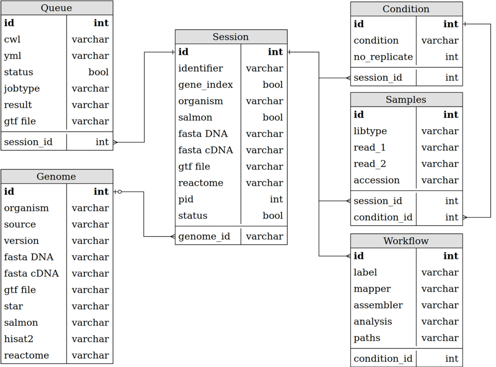

# Webportal

This repo contains the front-end interface of RAWG and is built with Django framework. The webportal is designed to be a simple and intuitive interface for researchers to upload data and define workflows.

For an online demo of the website, please see [demo](http://rawg.tony.tc) and [user guide](https://github.com/rawgene/rawg/blob/master/doc/userguide.md).

The current database schematic is shown below


## Webportal setup guide

For security reasons, Django's setting file is masked. For local development, you should make a copy of the `settings.py` and call it `local_settings.py`
  
You can run `cp ./webportal/settings.py ./webportal/local_settings.py` from the repository root.

Three main areas need to be modified before a Django website can be run:

* `SECRET_KEY`: this field is left empty. You can just add a random string to it (eg. Rawg is AWesome Gene) or run this Python code to generate a random string
  ```
  import random
  ''.join(random.SystemRandom().choice('abcdefghijklmnopqrstuvwxyz0123456789!@#$%^&*(-_=+)') for i in range(50))
  ```

* `DATABASES` need to be modified if you are connecting to a database other than the local sqlite3 database.

* `ALLOWED_HOSTS` need to be modified if you want to access the website remotely (i.e. other than `127.0.0.1`)
